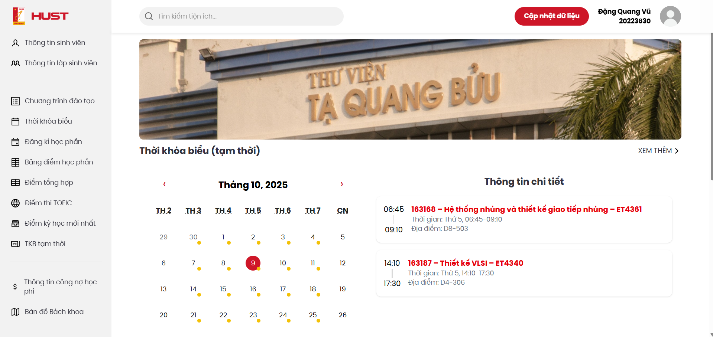

## HUST Student Assistant (Bản web)

HUST Student Assistant là hệ thống quản lý dữ liệu học tập của sinh viên Bách khoa (là bản cải thiện giao diện của web ctt-sis, là bản web của HUST Student và HUST SA).

    
    
    

### Tính năng

- Hiển thị các dữ liệu học tập của sinh viên.
- Phân tích điểm học tập bằng biểu đồ.
- Hiển thị thông báo mới nhất từ Đại học.

<i>Giao diện một phần của màn hình trang chủ</i>

### Cách sử dụng

Chạy giao diện: `npm run dev`.
